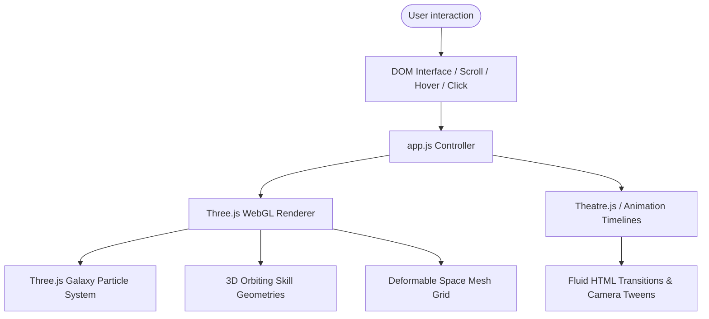
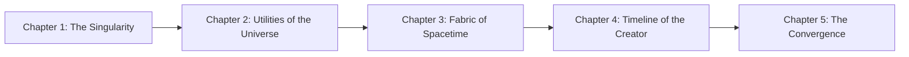

# Architecture Design - Cosmic Creator Portfolio

This document maps the component system interaction, WebGL rendering context, and animation sheets powering the cosmic creator portfolio site.

## System Workflow & Component Map

The site runs as a single-page interactive application, orchestrating Three.js scenes, custom GLSL displacement mathematics, Theatre.js timelines, and Anime.js triggers.

## Section Sequence & Visual Chapters

## Component Architecture

- **`index.html`**: Host structural DOM nodes, 3D WebGL `<canvas>` elements, and external script references (Three.js, Theatre.js, Anime.js).
- **`styles.css`**: Design tokens, space dark backgrounds, neon custom properties (`--glow-purple`, `--glow-cyan`, `--glow-amber`), glass overlay cards, and responsive positioning rules.
- **`app.js`**:
  - `UniverseController`: Manages window scroll progress, active chapter state, and sound generation.
  - `ThreeEngine`: Orchestrates the Three.js scene, cameras, perspective matrices, point lights, and rendering loop.
  - `ParticleGalaxy (Chapter 1)`: Populates and updates 1,500+ stars using math displacement to simulate the Big Bang shatter.
  - `OrbitingGeometries (Chapter 2)`: Generates floating 3D shapes (torus, sphere, knot) orbiting in Three.js space.
  - `SpacetimeLattice (Chapter 3)`: Renders a mesh plane representing physical spacetime, displacing vertices dynamically on scroll.
  - `SingularityWarp (Chapter 5)`: Animates a mathematical gravity well (black hole simulation) that bends coordinates towards the center.
